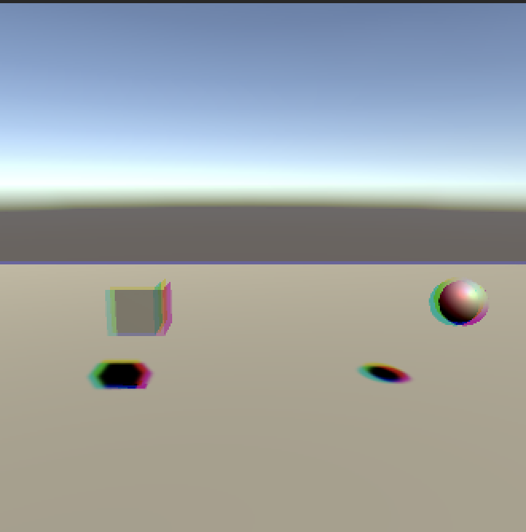

# unity-shaders-study
Project to study shader basics

## Magic Cube

Use stencil buffer to mask out objects inside cube.

## Portal Effect

Use stencil buffer and z-order to achieve effect of object going inside portal.

## Distortion Image Effect

Use distortion map to offset uv of rendered image.

## Box Blur

Simple box blur - mean of current pixel and its neighbours.

## Chromatic Aberration

Sample value for each color channel separately adding offset

